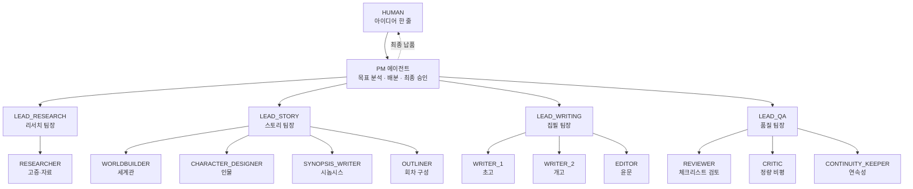
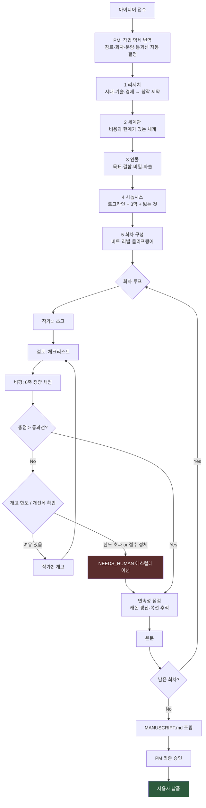
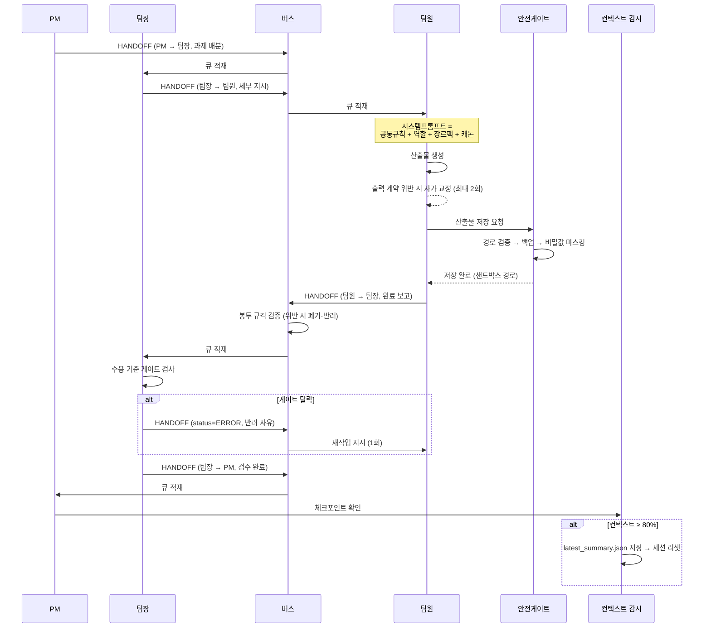

# 1. 시스템 아키텍처 및 작동 순서도

## 1.1 조직 구조



| 계층 | 역할 | 모델 호출 | 판단 근거 |
|---|---|---|---|
| **PM** | 요구사항 → 작업 명세 번역, 배분, 최종 승인/반려 | O (승인 시 1회) | 수용 기준 표 |
| **팀장 (LEAD_\*)** | 과제 분할 배정, **수용 기준 게이트 검사**, 상급 보고 | **X (결정론적 코드)** | `_gate()` 규칙 |
| **팀원 (WORKER)** | 격리 환경에서 단일 산출물 생산 후 즉시 보고 | O | 역할 프롬프트 |

> **왜 팀장은 모델을 안 쓰는가**
> 팀장의 실제 업무는 "이 산출물이 다음 단계로 갈 자격이 있는가"를 판정하는 것이다.
> `마법 체계에 비용/한계가 있는가`, `인물에 목표·결함이 채워졌는가`, `본문이 요약본이 아닌가` 같은
> 판정은 규칙으로 쓸 수 있고, 규칙은 모델보다 **정확하고 재현 가능하며 공짜다.**
> 모델은 창작(팀원)과 최종 판단(PM)에만 쓴다.

## 1.2 전체 작동 순서도



**각 화살표는 전부 버스를 지난다.** 에이전트끼리 직접 말을 거는 경로는 존재하지 않는다.

## 1.3 한 스텝을 확대하면



## 1.4 모듈 지도

```
novel-factory/
├── src/
│   ├── cli.js          진입점 — run / resume / status / bus / presets / doctor
│   ├── pm.js           오케스트레이터. 파이프라인·회차 루프·팀장 게이트·에스컬레이션
│   ├── agent.js        에이전트 실행기. 프롬프트 조립·출력 계약 강제·핸드오프 감독
│   ├── bus.js          핸드오프 버스. 원장 / 수신자 큐 / ack·nack / DLQ
│   ├── schema.js       HANDOFF_EVENT 규격 정의 및 검증기
│   ├── guard.js        샌드박스. 경로 격리 · 백업 · 비밀값 마스킹 · 금지 명령
│   ├── context.js      컨텍스트 감시(50/80/92%) · 캐싱 · 리셋 · 재개
│   ├── llm.js          프로바이더 어댑터(openai/anthropic/mock) + 재시도 + 예산
│   ├── roles.js        역할·장르 레지스트리 (prompts/ 를 단일 진실 원천으로 로드)
│   ├── mock-writer.js  오프라인 결정론적 더미 작가
│   ├── logger.js       구조화 로그
│   └── util.js         JSON 관대 파서, 한글 가중 토큰 추정 등
├── prompts/            ← 프롬프트의 단일 진실 원천. 여기만 고쳐도 조직이 바뀐다
│   ├── pm.md           PM 시스템 프롬프트
│   ├── common.md       팀장/팀원 공통 (안전 + 핸드오프 규칙)
│   ├── roles/*.md      역할별 프롬프트 11종
│   └── genres/*.md     작가 유형 팩 3종
├── config/default.json 통과선·개고 한도·컨텍스트 임계치·deny list·예산
└── test/smoke.test.js  21건 자체 검증
```

## 1.5 데이터 흐름의 원칙

**대화는 휘발되지만 파일은 남는다.**

에이전트 사이를 오가는 것은 원고 본문이 아니라 **경로**다(`data_payload_path`).
본문은 항상 샌드박스 파일로 존재하고, 봉투는 주소표 역할만 한다. 그래서:

- 세션이 죽어도 산출물이 살아남는다 → 재개가 가능하다
- 봉투가 작아서 버스가 가볍다 → 원장 전체를 메모리에 올려 감사할 수 있다
- 어느 단계 산출물이든 사람이 직접 열어보고 고칠 수 있다 → 부분 개입이 가능하다
