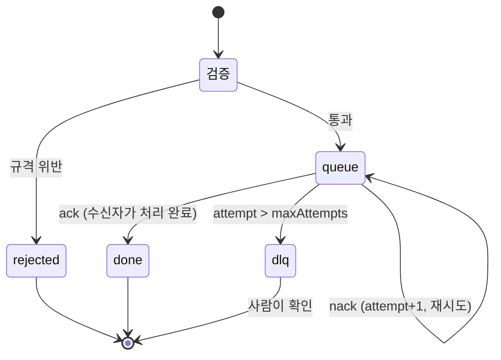

# 4. 핸드오프 · 버스 프로토콜 규격

에이전트끼리 자유 대화를 주고받지 않는다. **오직 이 봉투 하나만 버스를 통과한다.**
규격을 어긴 메시지는 전달되지 않고 `bus/rejected/` 로 떨어진다.

---

## 4.1 봉투 스키마

```jsonc
{
  "HANDOFF_EVENT": {
    // ── 필수 6개 (하나라도 비면 폐기) ──
    "sender":            "발신 에이전트 역할 코드",
    "receiver":          "수신 에이전트 역할 코드",
    "status":            "COMPLETE | IN_PROGRESS | ERROR | BLOCKED | NEEDS_HUMAN",
    "summary":           "핵심 작업 요약 (2000자 이하, 본문 복사 금지)",
    "next_action":       "수신자가 즉시 수행할 지시",
    "data_payload_path": "산출물 경로 (워크스페이스 상대경로, '..' 금지)",

    // ── 시스템이 자동으로 채우는 필드 ──
    "schema_version": "1.0",
    "event_id":       "evt_...",       // 고유 ID
    "trace_id":       "prj_...",       // 프로젝트 단위 추적 ID
    "seq":            42,              // 버스 전역 순번 (원장 순서 보장)
    "ts":             "ISO-8601",
    "attempt":        1,               // 재시도 횟수 (초과 시 DLQ)
    "metrics":        { "chars": 644, "context_ratio": 0.16 }
  }
}
```

### 필드 규칙

| 필드 | 검증 | 위반 시 |
|---|---|---|
| `sender` / `receiver` | 등록된 역할 코드 목록에만 존재해야 함 | 폐기 — 유령 에이전트·오배송 차단 |
| `status` | 5개 값 중 하나 | 폐기 |
| `summary` | 2000자 이하 | 폐기 — 본문을 봉투에 싣는 것을 구조적으로 막는다 |
| `data_payload_path` | `..` 포함 금지 | 폐기 — 경로 탈출 차단 |
| `sender` (재검) | **실행기가 덮어쓴다** | 모델이 다른 역할을 사칭할 수 없다 |

### 등록된 역할 코드

```
HUMAN · PM · BUS
LEAD_STORY · LEAD_WRITING · LEAD_QA · LEAD_RESEARCH
RESEARCHER · WORLDBUILDER · CHARACTER_DESIGNER · SYNOPSIS_WRITER · OUTLINER
WRITER_1 · REVIEWER · CRITIC · WRITER_2 · CONTINUITY_KEEPER · EDITOR
```

---

## 4.2 버스 구조

```
workspace/<projectId>/bus/
├── events.jsonl          append-only 원장 — 모든 사건. 삭제되지 않는다
├── queue/<RECEIVER>/     수신자별 미결 큐 (릴레이 전달)
├── done/                 ack 된 메시지
├── dlq/                  재시도 초과로 격리된 메시지 (dead letter)
├── rejected/             규격 위반으로 버스에 실리지 못한 원문 + 위반 사유
└── .seq                  전역 순번
```

### 상태 전이



### API

```js
bus.publish({ HANDOFF_EVENT })   // 검증 후 발행. {ok, event} 또는 {ok:false, errors}
bus.emit({ sender, receiver, ... })  // 규격 봉투를 만들어 바로 발행
bus.peek(receiver)               // 미결 1건 조회 (비파괴)
bus.pending(receiver)            // 미결 전체
bus.ack(file)                    // 처리 완료 → done/
bus.nack(file, err)              // 실패 → 재시도 또는 DLQ
bus.drain(receiver, note)        // 수신자가 대기 업무를 모두 소화했음을 확정
bus.trace(traceId)               // 프로젝트 단위 전체 흐름 재구성
bus.stats()                      // {total, byType, dlq, rejected}
```

**설계 포인트 — 왜 파일인가**
DB를 쓰면 스키마 관리와 프로세스가 늘어난다. 파일이면 프로세스가 죽어도 상태가 남고,
`cat`, `grep`, `git diff` 로 감사할 수 있으며, 컨텍스트 리셋 후 재개의 근거가 그대로 디스크에 있다.
규모가 커지면 `bus.js` 의 인터페이스를 유지한 채 SQLite/Redis 구현으로 바꿔 끼우면 된다.

---

## 4.3 실제 메시지 예시 (실행 원장에서 발췌)

### ① 사용자 → PM : 아이디어 접수

```json
{
  "HANDOFF_EVENT": {
    "seq": 1,
    "event_id": "evt_ms5sn4nb6ef711",
    "trace_id": "prj_ms5sn4n914dd1f",
    "ts": "2026-07-29T07:59:14.759Z",
    "sender": "HUMAN",
    "receiver": "PM",
    "status": "COMPLETE",
    "summary": "아이디어 접수: 기억을 파는 대가로 마력을 얻는 소년",
    "next_action": "웹소설 (연재형) 형식으로 2회차 제작하라.",
    "data_payload_path": "brief.json"
  }
}
```

### ② PM → 팀장 : 과제 배분

```json
{
  "HANDOFF_EVENT": {
    "seq": 2,
    "trace_id": "prj_ms5sn4n914dd1f",
    "sender": "PM",
    "receiver": "LEAD_RESEARCH",
    "status": "IN_PROGRESS",
    "summary": "RESEARCHER 과제 배분",
    "next_action": "아이디어 \"기억을 파는 대가로 마력을 얻는 소년\" 를 웹소설(연재형)로 집필하기 위한 배경 조사를 수행하라. 시대·기술·경제·풍습 축으로 조사하고 창작 제약으로 번역하라.",
    "data_payload_path": "canon/research.json"
  }
}
```

### ③ 팀원 → 팀장 : 완료 보고 (metrics 포함)

```json
{
  "HANDOFF_EVENT": {
    "seq": 4,
    "trace_id": "prj_ms5sn4n914dd1f",
    "sender": "RESEARCHER",
    "receiver": "LEAD_STORY",
    "status": "COMPLETE",
    "summary": "역사·기술·경제 3개 축 고증 자료 정리, 제약 2건 도출",
    "next_action": "LEAD_STORY 는 산출물을 검수하고 다음 단계로 전달하라.",
    "data_payload_path": "canon/research.json",
    "metrics": { "chars": 644, "context_ratio": 0.0 }
  }
}
```

### ④ 팀장 → 팀원 : 수용 기준 미달 반려

```json
{
  "HANDOFF_EVENT": {
    "sender": "LEAD_STORY",
    "receiver": "WORLDBUILDER",
    "status": "ERROR",
    "summary": "수용 기준 미달로 반려: 체계에 비용/한계가 없음 (만능 설정 반려) / 세력이 2개 미만 — 갈등 구조 부족",
    "next_action": "반려 사유를 모두 해소해 재제출하라.",
    "data_payload_path": "canon/world.json"
  }
}
```

### ⑤ 비평가 → 작가2 : 개고 지시 (분기점)

```json
{
  "HANDOFF_EVENT": {
    "sender": "CRITIC",
    "receiver": "WRITER_2",
    "status": "COMPLETE",
    "summary": "정량 채점 76점 / 판정 REVISE (통과선 80)",
    "next_action": "must_fix 3건을 전부 반영해 개고하라. keep 항목은 건드리지 마라.",
    "data_payload_path": "chapters/ch01.critique0.json"
  }
}
```

### ⑥ 품질팀장 → PM : 에스컬레이션 (사람 호출)

```json
{
  "HANDOFF_EVENT": {
    "sender": "LEAD_QA",
    "receiver": "PM",
    "status": "NEEDS_HUMAN",
    "summary": "제3화 품질 정체 — 개고 2회 후 최고 78점 (통과선 82). 점수 개선폭 1점으로 임계 미달",
    "next_action": "사용자 판단 필요: 통과선 조정 또는 방향 재지시",
    "data_payload_path": "chapters/ch03.draft3.md"
  }
}
```

### ⑦ PM → 사용자 : 최종 납품

```json
{
  "HANDOFF_EVENT": {
    "sender": "PM",
    "receiver": "HUMAN",
    "status": "COMPLETE",
    "summary": "전 2회차 통과선 충족 (85, 86점). 연속성 충돌 0건, 미회수 복선 2건 추적 중",
    "next_action": "MANUSCRIPT.md 를 검토하고, 4~6화 확장 여부를 결정해 주세요.",
    "data_payload_path": "MANUSCRIPT.md"
  }
}
```

---

## 4.4 흐름 확인

```bash
node src/cli.js bus <projectId> 200
```

```
#001 HUMAN → PM [COMPLETE] 아이디어 접수: 기억을 파는 대가로 마력을 얻는 소년
#002 PM → LEAD_RESEARCH [IN_PROGRESS] RESEARCHER 과제 배분
#003 LEAD_RESEARCH → RESEARCHER [IN_PROGRESS] 세부 과제 지시
#004 RESEARCHER → LEAD_STORY [COMPLETE] 역사·기술·경제 3개 축 고증 자료 정리, 제약 2건 도출
#005 LEAD_RESEARCH → PM [IN_PROGRESS] RESEARCHER 산출물 검수 완료
...
#087 PM → HUMAN [COMPLETE] 최종 승인 및 납품
```

프로젝트 하나(2회차)당 약 87건의 핸드오프가 원장에 남는다.
어느 시점에 누가 무엇을 왜 넘겼는지 전부 복원할 수 있다.
